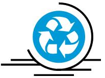

Instructor Information
======================

| Instructor | Email | Office Location & Hours |
|------------|-------|-------------------------|
||

General Information
===================

Summary
-------

Students expand their understanding of solid waste management to include the idea of 3RC: reduce, reuse, recycle and compost. They look at the effects of packaging decisions (reducing) and learn about engineering advancements in packaging materials and solid waste management. Through an associated activity, they observe biodegradation in a model landfill (composting).
----------------------------------------------------------------------------------------------------------------------------------------------------------------------------------------------------------------------------------------------------------------------------------------------------------------------------------------------------------------------------------

Engineering Connection
----------------------

Engineers are involved in all steps of integrated-waste management. They use smaller amounts of materials to package products, and use recyclable and reusable materials when possible. Chemical engineers develop environmentally friendly, recyclable materials. Engineers investigate ways to accelerate the decomposition process, develop industrial systems that burn trash for energy at power plants, and design innovative landfills that are more economical and reduce pollution.

Expectations and Goals
----------------------

After this lesson, students should be able to:

-   Explain different methods of waste disposal.

-   Explain some of the major problems that waste disposal causes.

-   Explain 3 (reduce, reuse, recycle, compost).

-   Describe the different steps involved in integrated waste management.

-   Identify ways engineers are involved in 3RC and solid waste management.

Introduction/Motivation

Trash... Did you know that people and industry produced more than 236 million tons of waste in 2003, which is more than four pounds of trash per person per day? Wow, that's a lot of garbage!

What are some different ways to dispose of trash? (Brainstorm a list of answers as a class. Expect students to mention landfills and recycling centers, and maybe dumps, trash cans, compost bins, etc.). Write student suggestions on the classroom board.

The most environmentally friendly ways to dispose of trash are to reduce, reuse, recycle and compost. We call these 3RC. These are the first four steps in "integrated waste management." This means that you try to reduce the amount of garbage by the first step (reduce) and with what garbage is left, you venture onto the next step (recycle), and so on, until the garbage or waste is all gone. The key is to have barely any waste left when reaching the last step.

A total of seven steps comprise integrated waste management. (Note: You may want to have an overhead transparency or other classroom copy of the seven steps already prepared and available for reference at this point; see the [7 Steps of Integrated Waste Management Transparency](https://www.teachengineering.org/collection/cub_/lessons/cub_environ/cub_environ_lesson05_transparency.pdf).) In order, the seven steps are: reduce, reuse, recycle, compost, incineration with energy as a result, landfills and incineration with no energy. Engineers are involved at every step of this process. Can you explain how? What might engineers do to make sure that very little waste is being handled by the processes in steps 6 and 7? (Answer: By developing better technologies to help with steps 1-5.) What things might *you *do to make sure that very little waste is being handled by the processes in steps 6 and 7? (Answer: 3RC: reduce, reuse, recycle and compost.) In this lesson, you will learn more about how engineers help reduce environmental waste and garbage today.

Lesson Background and Concepts for Teachers

No simple, single solution exists to solid waste management. The current thinking is that it should be an integrated, seven-step process, including the 3RC process (the first four steps), incineration (waste-to-energy), landfills and incineration (no energy production). It is ideal to combine the first five of these in such a way as to eliminate — or at least drastically reduce — the amount of waste that has to be dealt with in steps 6 and 7.

**7 Steps of Integrated Waste Management**

(Steps 1-4 represent the 3RC process discussed in detail in this lesson.)

**Step 1 Reduce: **As a society, we should make less waste overall. For example, buy items with little or no packaging, use rechargeable batteries, use existing products longer, share items with other people, decide not to purchase an additional car or piece of clothing, etc.

**Step 2 Reuse: **We should reuse items we normally throw away. For example, using paper lunch bags multiple times instead of throwing them away after just one use.

**Step 3 Recycle: **We should remember to recycle items that are recyclable (paper and plastic items have a recycling code stamped on them to tell us if they can be recycled). Also, we can "close the recycling loop" by buying items made from and packaged in recycled materials. We must continue looking for new ways to recycle currently non-recyclable items.

**Step 4 Compost:** We should put our yard waste and food scraps in personal or community compost bins to enrich the soil.

**Step 5 Incineration (waste-to-energy): **We should burn trash and use the heat to produce energy for power plants, etc. This should be done on the industrial scale, not at a personal level.

**Step 6 Landfills: **We should store any leftover waste in a sanitary landfill to reduce the risk to the environment.

**Step 7 Incineration (no energy production): **We can burn trash just to reduce the amount of space it takes up. This is often done on an individual basis (outside a single home), but it can also be done on an industrial scale. This type of incineration is really the last resort and should be the last thing that we do since it creates and contributes to environmental hazards.

Engineers are involved at every step of this process. This lesson describes their involvement in steps 1-5. Please see Lesson 4 for engineers' involvement in landfill use.

Vocabulary/Definitions

| [*3RC*](https://en.wikipedia.org/wiki/Special:Search?search=3RC)*:*                     | An acronym for reduce, reuse, recycle and compost.                                                                                                                                                                                                   |
|-----------------------------------------------------------------------------------------|------------------------------------------------------------------------------------------------------------------------------------------------------------------------------------------------------------------------------------------------------|
| [*biodegradable*](https://en.wikipedia.org/wiki/Special:Search?search=biodegradable)*:* | The ability to be broken down by natural environmental processes (involving microorganisms) into basic elements like carbon dioxide, nitrogen and water.                                                                                             |
| [*composting*](https://en.wikipedia.org/wiki/Special:Search?search=composting)*:*       | A process in which food, yard and animal wastes decomposes into new soil. Engineers often work to optimize the process so that biodegradation takes place more quickly and efficiently.                                                              |
| [*hydro pulping*](https://en.wikipedia.org/wiki/Special:Search?search=hydropulping)*:*  | A process by which aseptic packages are recycled. Water and agitation separate the packaging layers.                                                                                                                                                 |
| [*organic*](https://en.wikipedia.org/wiki/Special:Search?search=organic)*:*             | Created from or by living organisms.                                                                                                                                                                                                                 |
| [*recycle*](https://en.wikipedia.org/wiki/Special:Search?search=recycle)*:*             | Processing waste and using it as raw material for new products; that is, making trash into something useful instead of just throwing it out. It is often called "resource recovery" because it is actually recovering and reusing natural resources. |
| [*reduce*](https://en.wikipedia.org/wiki/Special:Search?search=reduce)*:*               | Minimizing the production and consumption of items that are made from new, NOT recycled, materials. Not creating trash in the first place and lessening in amount, number or other quantity (precycling).                                            |
| [*reuse*](https://en.wikipedia.org/wiki/Special:Search?search=reuse)*:*                 | Extending the life of an item by using it again, repairing it, modifying it, or creating new uses for it instead of throwing it away.                                                                                                                |

Associated Activities

-   [It's All in the Package](https://www.teachengineering.org/view_activity.php?url=collection/cub_/activities/cub_environ/cub_environ_lesson05_activity1.xml) - Students explore the concept of "reducing" solid waste and how this relates to product packaging. They read about and evaluate the highly publicized packaging decisions of two major U.S. corporations. They evaluate different ways to package items to minimize the environmental impact, while considering issues such as cost, availability, attractiveness, etc. Students explore "hydro pulping" and consider its use as a recycling process.

-   [Composting - Nature's Disappearing Act](https://www.teachengineering.org/view_activity.php?url=collection/cub_/activities/cub_environ/cub_environ_lesson05_activity2.xml) - Students explore the idea of biodegradability by building and observing model landfills. This serves as an introduction to the idea of composting. (Note: This activity can be integrated as an extension of Lesson 4's activity: This Landfill Is a Gas.

-   [Recycled Towers](https://www.teachengineering.org/view_activity.php?url=collection/cub_/activities/cub_environ/cub_environ_lesson05_activity3.xml) - Students learn about material reuse by designing and building the strongest and tallest tower they can, using only recycled materials. They follow design constraints and build their towers to withstand an earthquake and high wind simulations.

Lesson Closure

Review the seven steps of integrated waste management. Ask students to describe one way that they could help with solid waste management in their own homes, schools and communities. Which of the seven steps do their responses relate to? Will they help decrease waste for steps 6 and 7? Challenge the class to reduce the trash that they produce and help one other person reduce his/her trash as well.

Attachments

-   7 Steps of Integrated Waste Management Transparency (pdf)

-   Recycle Now Song Lyrics (pdf)

-   Homework Math Challenge Worksheet (pdf)

-   Homework Math Challenge Worksheet Answers (pdf)

Assessment

**Pre-Lesson Assessment**

*Brainstorming:* As a class, have students engage in open discussion to brainstorm different ways to dispose of trash. Remind students that in brainstorming, no idea or suggestion is "silly." All ideas should be respectfully heard. Encourage wild ideas and discourage criticism of ideas. Write student suggestions on the classroom board.

**Post-Introduction Assessment**

*Question/Answer:* After going through the seven steps of integrated waste management, ask the students and discuss as a class:

-   How are engineers involved in each step?

-   What might engineers do to make sure that very little waste is being handled by the processes in steps 6 and 7. (Answer: By increasing technologies to help with steps 1-5.)

-   What might you do to make sure that very little waste is being handled by the processes in steps 6 and 7? (Answer: 3RC: reduce, reuse, recycle, compost.)

**Lesson Summary Assessment**

*Performance:* Teach students the [Recycle Now Song](https://www.teachengineering.org/collection/cub_/lessons/cub_environ/cub_environ_lesson05_recyclesong.pdf), which uses the melody from "Three Blind Mice." Have each student sing a line until every student has had a chance.

*Quick Quiz*: Ask students to:

-   Write down what 3RC stands for. (Answer: Reduce, reuse, and recycle, compost.)

-   Describe one way you can be involved in 3RC. (Accept all reasonable answers.)

-   Describe how an engineer might be involved in one of the 3RC steps.

**Homework**

*Math Assignment:* Hand out the Math Challenge Worksheet as a challenge activity for students. Review the answers during the next class period.

Lesson Extension Activities

Arrange to teach a younger class about recycling (natural and human). Pair each student with a student in a younger class. Have the older students teach the younger students the Recycle Now Song.

Share some of the stories in *Recycling (Making a Better World)* by Gary Chandler and Devin Graham (published by 21st Century, 1997).

Try using some of the "Recycle City" activities at the EPA website at: http://www3.epa.gov/recyclecity/. Be sure to check out the "Information for Teachers" in the Activities section.

Have students take the "It's not all garbage!" quiz at EEK (Environmental Education for Kids) athttp://dnr.wi.gov/org/caer/ce/eek/earth/recycle/notgarbage.htm

Try out some of the activities in "Recycling and Beyond" at http://dnr.wi.gov/org/caer/ce/eek/earth/recycle/index.htm

Check out pictures of Simon Rodia's "garbage sculptures" at http://www.wattstowers.us or from online searches of "Watts Towers." Mr. Rodia spent 33 years creating garbage sculptures, of which some parts are more than 60 feet tall! Ask students what effect they think his efforts had on the surrounding community. How was engineering knowledge useful to him in creating his sculptures? (Note: Encourage students to consider structural and material engineering ideas.) Discuss similar activities in your community.

Think of trash as a resource that hasn't yet found its usefulness. Challenge students to design useful products with the limitation of only using recycled materials (for example, toy, bird feeder, piggy bank, pencil holder, picture frame, handmade paper or artwork, gifts, etc.). For ideas, start with the suggestions and links at Creative Displays Now's "Creative Cardboard: Environmentally Friendly Recycled Art Projects for Kids" website at http://www.creativedisplaysnow.com/articles/creative\_cardboard.htm

Invite a local artist/artisan to discuss how s/he recycles or reuses material in his/her artwork or profession.

Continue learning about recycling through playing games, taking trivia quiz challenges, doing arts and crafts projects, watching videos and even hearing a new song. *Saving Money & the Environment: A Kid's Guide to Recycling* is filled with fun resources for all these activities and more. You can find this information at: <http://www.upack.com/moving-services/articles/saving-money-the-environment-a-kids-guide-to-recycling/>

References

Blashfield, Jean F. and Black, Wallace B. Black. *Recycling (SOS Earth Alert).* Chicago, IL: Childrens Press, Inc., 1991.

Chandler, Gary and Devin Graham. *Recycling (Making a Better World)*. New York, NY: 21st Century, 1997.

*7 Steps to Shrink Your Trash.* Department of Natural Resources, Wisconsin. http://dnr.wi.gov/org/caer/ce/eek/earth/recycle/index.htm

*An Introduction to the Life, Earth and Physical Sciences*. Student Edition, Glencoe Science. Blacklick, OH: Glencoe/McGraw-Hill, 2002.

Sterling, Mary Ellen and Keith Vasconcelles. *Thematic Unit – Ecology (Intermediate).* Westminster, CA: Teacher Created Materials, Inc., 1991.

*Wastes*. Last updated March 23, 2011. U.S. Environmental Protection Agency. Accessed April 6, 2011. http://www.epa.gov/epawaste/index.htm

Woodburn, Judith. *Garbage and Recycling.* Milwaukee, WI: Gareth Stevens Publishing, 1992.
