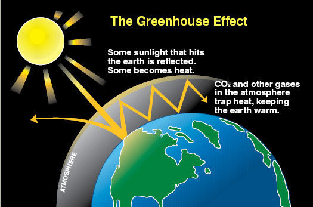
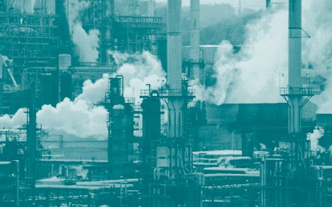
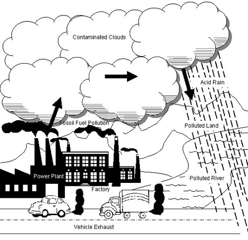

Summary

Students are introduced to the concepts of air pollution and air quality. The three lesson parts (including its associated activities) focus on the prerequisites for understanding air pollution. First, students use M&M® candies to create pie graphs that express their understanding of the composition of air. Next, they watch and conduct several simple experiments to develop an understanding of the properties of air (it has mass, it takes up space, it can move, it exerts pressure, it can do work). Finally, students develop awareness and understanding of the daily air quality using the Air Quality Index (AQI) listed in the newspaper or online. In an associated literacy activity, students explore the environmental history timeline.

Engineering Connection

Air pollution is becoming an increasing concern as we learn more about the adverse health effects of poor air quality. Engineers investigate the source and effect of air pollution on people and their environment, and do their best to prevent it and clean it up. Environmental engineers must know the composition of air and chemicals to determine how to mitigate poor air quality.

Educational Standards 

-     Colorado: Science

-     International Technology and Engineering Educators Association: Technology

-     Next Generation Science Standards: Science

Learning Objectives

After this lesson, students should be able to:

-   Identify some of the main causes, effects and sources of air pollution.

-   Define Air Quality Index (AQI).

-   Explain the properties of air (takes up space, has mass, can move, exerts pressure, can do work.)

-   Describe the roles of engineers in addressing air pollution.

-   Explain how air pollutants affect the temperature of the atmosphere.

Introduction/Motivation

**Before Class Begins**

Print the Air Sayings attachment, page 1. Cut apart each of the boxes containing the sayings and meanings. You may have more of your own sayings/meanings to add.

Alternatively, you could give students a handout (Scrambled Air Sayings, use page 2 of the Air Sayings attachment) and have them match the sayings to the meanings, or write the air sayings on the board or on a transparency (use page 3 of the Air Sayings attachment) and ask students to describe what the sayings mean.

**With the Students**

Hand out one strip (either a saying or a meaning) to each student as s/he enters the classroom. Tell the students that some of them have received a strip with a saying that we commonly use that makes reference to air. Explain that other students in the classroom have received a description of what one of the air sayings means. You may want to use one of them as an example.

Ask the students to walk around and find their partner. Each pair should consist of a matching saying and meaning.

After all the students have found their partners, ask them to read their sayings and meanings aloud to the rest of the class. Have the students return to their seats.

Discuss the following questions with the students.

-   Why do you think we have all these sayings that relate to air? (Possible answer: Air is important to us because it contains oxygen, which is essential to life.)

-   Why air is so important to us? (See above answer.)

-   Does the quality of our air matter? Is clean air important? (Answer: Yes, polluted air can cause serious problems for us and our environment. See the Background section for more details.)

-   How does air get dirty? What is air pollution? What are air pollution sources? (Answer: Air pollution is caused by several things that people do, especially burning fossil fuels. See Figure 1. See the Background section for more details.)

-   What could happen if you breathe polluted air? (Answer: Polluted air can cause itchy eyes, coughing and diseases for humans and other life on Earth, as well as change or destroy our buildings, etc. Very find dust in the air can actually enter our bloodstream directly and cause both respirator and cardiovascular problems. See the Background section for more details.)

-   How do air pollutants affect the earth on a global scale? (Answer: A number of pollutants, including carbon dioxide (CO2) and methane (CH4), hold in infrared radiation (heat) very well and act as a blanket for the planet. Also pollutants such as chlorofluorohydrocarbons (CFCs) deplete the protective ozone layer, thereby allowing more ultraviolet light to enter into the atmosphere. Furthermore, dust or particulate matter collects on the polar ice caps and results in more energy being absorbed, rather than reflected. (Note: Show students Figure 2 for a simplified illustration of how greenhouse gases promote global wraming.)Figure 2. The greenhouse effect.

> *copyright*

-   Distribute the attached Air Pollution Sources chart. Briefly discuss the contents. Ask students to keep this chart for reference during the Air Pollution unit.

Share the following information with the students.

-   Long ago, people were not worried about clean air because we seemed to have an endless supply. Today, many more people live in our world, and we are rapidly polluting this essential resource. We need to find better ways to protect and improve our air.

-   In this unit, students consider what air pollution is, the sources, the effect it has on us and our environment, and ways to prevent it and clean it up. Engineers play integral roles in the problems of and the solutions to air pollution.

-   Students begin with this lesson to develop their understanding of the composition and properties of air as well as some general definitions and awareness of air quality.

-   Engineers begin with these same basic understandings of air and air pollution in order to develop air pollution prevention and clean-up techniques and technologies.

Lesson Background and Concepts for Teachers

Most of the time, we hardly notice the air around us. We cannot usually see it or taste it. Air does not usually smell (but it does carry substances that we do smell). However, you can feel air when it moves and you can see the effects of air on your surroundings. When air moves, it has great power (to push sailboats, drive windmills and move clouds), and when it is compressed (squashed into a small space), it has great strength (air in a tire supports a vehicle and helps a helicopter to rise into the air).

We must have air to survive. Because of this, engineers work to solve our air pollution problems. There are many things that complicate these solutions, so engineers who work on air pollution problems must have a firm understanding of the composition, properties and behavior of air.

**Air Pollution History**

About 800 years ago, King Edward I of England (1272 – 1307) imposed a death penalty on anyone found burning coal (the high sulfur type), because it created noxious fumes and an "intolerable smell." During Queen Elizabeth I's (1558 – 1603) reign, she created laws to stop people from burning coal in London, but coal was so cheap that no one paid much attention. In the 17th century, John Evelyn wrote two books about pollution (about smoke pollution in London and about plans to save woodlands).

Serious problems started in the 1800s with the coal-burning factories of the Industrial Revolution era. During this time, much home-based hand manufacturing shifted to large-scale factory production. One consequence was a great increase in pollution emitted into our skies (see Figure 3). The introduction of motor vehicles in the 1900s increased atmospheric pollution greatly.

Figure 3. Modern day industrial air pollution.

*copyright*

In the 1970s, the U.S. passed legislation to curb sources of air pollution and set standards for air quality. In 1987, more than 20 nations signed an agreement to limit CFC (chlorofluorocarbon) production and work towards eliminating them altogether. In 1989, major car manufacturers and oil companies funded a $40 million research study to help find ways to reduce emissions. In 1990, Congress passed the Clean Air Act, which requires industry and individuals to take additional steps to clean the air in our cities.

**What Are Air Pollutants?**

Clean air contains only the gases and water vapor needed to keep the Earth's environment healthy. Pollutants are substances, or even energy, that contaminate our air and harm living things (and some non-living ones, too). A high concentration of pollutants in the air is called air pollution.

There are literally hundreds of pollutants that float around in the air that we breathe. Some come from natural sources, but most come from human activity. Air pollutants consist of numerous particulates, fibers, mists, molds, bacteria and gases. They are found outdoors and indoors. Climatic conditions and emission sources dictate the magnitude and variety of air pollutants found outdoors. Most major air pollutants are invisible, but large amounts of them can be seen as smog when they are concentrated in areas such as cities. (See Air Pollution Unit, Lessons 2 and 3, for details about visible and invisible air pollutants.)

Indoor air pollution is becoming a large concern for environmental engineers because the majority of the public's time is spent indoors. Indoor air pollutants include: pesticides, dust, fibers, furnishings, radon, fungi, chemicals, cleaning supplies and animal dander. (Refer to Air Pollution Unit, Lesson 9, for more information.)

Some people also consider sound pollution a type of air pollution because sound waves travel through the air. Outdoor sources include loud jet engines, construction equipment, huge trucks and other forms of transportation, etc. Indoor sources include music, TVs, mixers, dishwashers, washing machines, etc. Bright outdoor lights are also considered a source of air pollution, especially to astronomers.

**Air Pollution Sources**

**Outdoor Sources** — The burning of fossil fuels is one of the main causes of air pollution. Smoke and fumes containing carbon dioxide and sulfur dioxide from power stations and factories are the worst offenders. Car exhaust is another primary source of air pollution. It contains both invisible gases (carbon dioxide, carbon monoxide, hydrocarbons and nitrogen oxides) and particles. Many consumer products (hair spray, paint, cleaners) release high levels of volatile organic compounds (VOCs) into the atmosphere. Other substantial sources of outdoor air pollution include gas stations, industry, agriculture and forestry.

Volcanic eruptions, a natural outdoor source of air pollution, often spew gases and ash into the atmosphere. Forest fires also release dust and smoke into the air.

**Indoor Sources** — Indoor air pollutants can be created within a building or drawn inside from outdoor sources. Indoor sources include: foundations, equipment (malfunctioning HVAC systems, emissions from office equipment/labs), furnishings (new carpet that releases formaldehyde and burnt Teflon pans), dust-producing or water-damaged materials, unsanitary trash emissions, insects and pests, food preparation areas, cleaning materials, pets and people (smoking). Some of the most common outdoor air pollutants that are brought inside are: smog, bacteria and mold spores, vehicle exhaust, exhaust fumes, pollen and dust, algae (from standing water) and smoke.

**How Do Air Pollutants Affect Us?**

The cumulative effect of air pollution destroys our environment and poses health threats to humans and other living organisms. Air pollution can make people sick, make things dirty, damage buildings and our ecosystem, change the weather, trap heat and make the air warmer than it should be, chew holes in the atmosphere and mix with clouds to form poisonous acid rain.

Air pollutants may cause a variety of adverse human health effects ranging from minor (rashes, eye/nose irritation, headaches, fatigue, shortness of breath, coughing, sneezing and dizziness) to major effects (cancer, breathing complications/asthma, kidney failure, liver damage and birth defects). The degree of the health effects depends on the magnitude and frequency of exposure to the pollutants.

Environmental effects are also numerous. For example, sulfur dioxide emissions combine with water particles and fall to the Earth in the form of acid rain or snow. This destroys the food and nutrients for fish and other aquatic life in oceans, lakes and streams. It damages trees, other plants and even some buildings. CFCs transform and destroy the ozone layer, which increases the Earth's exposure to ultraviolet radiation and can cause crop failures, skin cancer and other environmental/health disasters.

The *water cycle* usually cleans the air of pollutants naturally. Currently, however, there are two problems with this: the water cycle is unable to clean contaminants as quickly as they are added, and high concentrations of pollutants contribute to acid rain (see Figure 4).

Figure 4. The air pollution cycle. Pollution enters the water cycle and contaminates our natural resources.

*copyright*

**What Are Air Pollutant Solutions?**

How do we get people to keep the air clean? The government passes strict legislation to control the amount of by-products released by industrial companies and modes of transportation. These air quality standards are designed to protect the health and welfare of people, plants and animals, and protect structures, monuments, water resources, etc. The U.S. Environmental Protection Agency (EPA) set national standards for six specific air pollutants that tend to reach unsafe levels. These six pollutants are: carbon monoxide (from vehicles), nitrogen oxides (from power plants), lead (from metal refineries), sulfur dioxide (from coal-burning power plants), particulate matter and tropospheric (low-level) ozone (not to be confused with upper-level ozone — also called stratospheric ozone — which helps filter out harmful rays from the sun).

On a more personal level, adjustments can be made to help improve the air. For example, one can reduce fuel use by joining a car pool, taking the bus/train, riding a bike or walking. In general, reducing energy use (especially in our homes) can be an important contribution to improving air quality. Also, some people choose to buy and use more environmentally-friendly products such as non-aerosol hair spray and non-toxic cleansers.

**Who Cares? Why Do We Need Pollution Solutions?**

Oxygen is a colorless, tasteless and odorless gas that forms about 21% of the Earth's atmosphere (by volume). All living things need the oxygen in the air to survive. Without the oxygen gas available in non-polluted air, the Earth would not have any living organisms.

Humans cannot live without oxygen for more than a few minutes. Because air is essential to our survival, our bodies are constantly interacting with it. Air enters our bodies through our mouths and noses. Inhalation is the process of breathing air through the mouth and nose into our lungs. Once air enters the lungs, cells take the oxygen from the air and distribute it throughout the body. Once the cells have finished with the oxygen, our body exhales and pushes out the remaining air (and the carbon dioxide by-product) from our lungs.

Air supports other biological activities as well. Air allows us to hear (objects move the air around them and these air waves cause our eardrum to vibrate). Air allows us to see (light travels through air very quickly). Air allows us to smell (carries tiny particles that make up odors).

Air is also necessary in many non-biological activities. Air helps distribute heat and water around the world. We can tell that air is at work when objects (leaves, branches, flags, clouds) are moving, and when thunder is crashing. There are many other objects that rely on air to move, too. An airplane uses air to help it take off from the runway, a bird needs it to fly, a sailboat needs it to move in the water, and a hot air balloon uses it to rise off the ground. Other uses for air include heating and cooling, recreation, energy and pollination.

What will the world be like if we do not develop some solutions to our air pollution problems? Even today, if people travel to places where there is not as much oxygen/air (tops of mountains, underwater) or no air at all (space) they must take air with them. This could become an everyday experience if we continue to neglect and mistreat this essential natural resource.

Read more about air pollution in the attached Air Pollution Reading and Health Effects Reading.

**Air Pollution Facts**

-   Mexico City is one of the world's most polluted cities. When pollution is really bad, birds have been known to drop dead out of the sky.

-   Every day, each of the world's 11 billion cattle gives off one pound of methane (produced in their gut as they digest food). How much methane is produced every year? (Answer: 274 billion pounds or 137 million tons.) Methane is also produced in large quantities by rotting vegetation in landfills. Methane is a very potent greenhouse gas; it contributes readily to the increasing temperature of our earth's atmosphere.

-   The average person takes about 20,000 breaths a day.

-   Even though plants make oxygen, which is essential to live, people have destroyed almost two-thirds of the original forests on Earth.

Vocabulary/Definitions

| *air:*                       | The mixture of invisible, odorless, tasteless gases (mainly nitrogen and oxygen) that surrounds the Earth.                                                                                                                                                                                                                                                              |
|------------------------------|-------------------------------------------------------------------------------------------------------------------------------------------------------------------------------------------------------------------------------------------------------------------------------------------------------------------------------------------------------------------------|
| *air pollution :*            | The gases and particles that negatively affect the quality of the air around us, are harmful to the environment and/or enter the atmosphere at highly concentrated levels (for example, oxygen and pollen are often present in the air, but are not considered pollution). Generally consists of: visible gases, invisible gases and particulate matter (such as soot). |
| *allergy:*                   | A physical reaction (sneezing, coughing, etc.) to something in the air (such as pollen, dust, dander, pollution, etc.).                                                                                                                                                                                                                                                 |
| *asthma:*                    | A condition, often caused by allergies, that causes a tightness in the chest (breathing tubes become swollen), difficulty breathing (cannot get enough air) and wheezing.                                                                                                                                                                                               |
| *atmosphere:*                | The layer of air that surrounds the Earth like a blanket. It keeps the Earth warm and protects it from harmful radiation.                                                                                                                                                                                                                                               |
| *carbon dioxide:*            | A colorless, highly poisonous odorless gas made of one carbon and two oxygen atoms formed during breathing, combustion and biomass decaying, which adds to the greenhouse effect by retaining infrared radiation within the atmosphere. Abbreviated as CO2.                                                                                                             |
| *carbon monoxide:*           | A colorless, odorless gas made of one carbon atom and one oxygen atom. Very harmful at elevated levels. Abbreviated as CO.                                                                                                                                                                                                                                              |
| *chlorofluorocarbon:*        | Any of various compounds consisting of carbon, hydrogen, chlorine and fluorine, once used widely as aerosol propellants and refrigerants. Chlorofluorocarbons are believed to cause depletion of the atmospheric ozone layer. Abbreviated as CFC.                                                                                                                       |
| *dioxin:*                    | A highly toxic family of chemicals used to make poisonous substances such as weed killers and bleaching products (for example, to make paper white). Also released from burning plastics. Poisonous at 1 part per billion (ppb).                                                                                                                                        |
| *emission:*                  | Gases or particles that are given off from man-made sources (for example, when fossil fuels are burned) and natural sources (for example, from plant photosynthesis).                                                                                                                                                                                                   |
| *fossil fuel:*               | A material that forms naturally, underground from the remains of ancient organisms (plants and animals) from millions of years ago. For example, petroleum, coal, natural gas.                                                                                                                                                                                          |
| *greenhouse effect:*         | The phenomenon whereby the Earth's atmosphere traps solar radiation, caused by the presence in the atmosphere of gases such as carbon dioxide, water vapor and methane that allow incoming sunlight to pass through but absorb heat radiated back from the Earth's surface.                                                                                             |
| *hydrocarbon:*               | An organic compound containing atoms of hydrogen and carbon.                                                                                                                                                                                                                                                                                                            |
| *nitrogen oxide:*            | A gas that form when nitrogen and oxygen in the atmosphere are burned with fossil fuels at high temperatures. Abbreviated as NOx.                                                                                                                                                                                                                                       |
| *oxygen:*                    | A colorless, tasteless, odorless gaseous element that constitutes 21% of the atmosphere. Abbreviated as O.                                                                                                                                                                                                                                                              |
| *ozone:*                     | Ground-level ozone is the principal component of smog, created from chemical reactions of pollutants; VOCs, and NOX. A strong oxidant. Abbreviated as O3.                                                                                                                                                                                                               |
| *particulate matter:*        | Very small material suspended in the air in the form of minute solid particles or liquid droplets, especially when considered as an atmospheric pollutant. Includes anything that floats in the air, such as materials that have been burned (ash, smoke, soot), dust, pollen, soil, chemicals, etc. Abbreviated as PM.                                                 |
| *pollen:*                    | The powdery grains of flowering plants (they fertilize seeds). Usually appears as a fine yellow dust.                                                                                                                                                                                                                                                                   |
| *pollutant:*                 | A harmful chemical or waste material discharged into the water or atmosphere. Some are visible and some are invisible.                                                                                                                                                                                                                                                  |
| *reformulated gasoline:*     | A cleaner-burning form of gasoline that reduces the amount of pollutants emitted into the air through tailpipes and via evaporation from the gas tank. Oxygenates are a principal component. Abbreviated as RFG.                                                                                                                                                        |
| *stratosphere:*              | The layer of air that extends from about 10 to 30 miles above the Earth's surface.                                                                                                                                                                                                                                                                                      |
| *volatile organic compound:* | An organic chemical containing carbon that escapes into the air easily. Abbreviated as VOC. Many VOCs are also hazardous air pollutants that can cause serious illnesses. Carbon is the basic chemical element found in living beings; carbon-containing chemicals are called organic. Example VOCs include some hairspray, cleaners, air fresheners and paints.        |

Associated Activities

-   A Recipe for Air - Students use M&Ms® to create a pie charts that express their understanding of the composition of air.

-   Air – Is It Really There? - Students develop an understanding of the properties of air (it has mass, it takes up space, it can move, it exerts pressure, it can do work) by watching and conducting several simple experiments.

-   What Color is Your Air Today? - Students develop awareness and understanding of the daily air quality using the Air Quality Index (AQI) listed in the newspaper or online.

-   Environmental History Timeline - In this literacy activity, students develop critical thinking skills, learn about the concept of a timeline and develop a sense of the context of events.

Lesson Closure

As a class exercise with student participation, read the attached The Day the Air Pollution Gremlins Came to Town short play.

Attachments

-   Air Sayings (pdf)

-   Air Pollution Sources (pdf)

-   Air Pollution Reading (pdf)

-   Health Effects Reading (pdf)

-   Closure Activity: The Day the Air Pollution Gremlins Came to Town (pdf)

-   Air Pollution Flashcards (pdf)

Assessment

**Pre-Lesson Assessment**

*Air Sayings Game*: Have students become familiar with everyday sayings related to air, as directed in the Introduction / Motivation section.

**Post-Introduction Assessment**

*Discussion Questions*: Have students respond to discussion questions provided in the Introduction / Motivation section.

**Lesson Summary Assessment**

*Flashcards*: Have students create flashcards of air pollution terms and definitions. Materials list:

-   Air Pollution Flashcards, one per student (print two-sided)

-   scissors

-   magazines/newspapers for students to cut up

-   colored pencils or crayons or markers

-   glue

Note: Blank flash cards are also provided in the attachment so you can have students add to their flashcards throughout the Air Pollution unit by adding the new vocabulary terms in each lesson.

**Homework**

*Internet Search*: Divide the flashcards up among team members. Have them search for the terms on the Internet, and record (on the term side of the flashcard) the website at which they found the term or concept. Have them pick the two sites that interested them the most and share them with the class during the next class period.

Lesson Extension Activities

An additional activity that demonstrates the presence of air and how it is useful is playing with parachutes. Students can make their own or purchase inexpensive toy parachutes at drug stores.

Invite someone from the EPA (or other local person responsible for monitoring air quality) to your classroom. Encourage students to ask questions about the types, causes and levels of air pollution in your community, and what measures are in place to improve the air quality.

Find out about factories in your area. What do they make? What types of waste do they produce? How do they dispose of the waste? Investigate them on the EPA website (www.epa.gov).

The EPA offers a free Indoor Air Quality Tools for Schools Kit.

Try the activities at the Environmental Education for Kids: The Air around Us page at the Wisconsin Department of Natural Resources website: www.dnr.state.wi.us/org/caer/ce/eek/earth/air/index.htm. .

Download the Texas Commission on Environmental Quality's Air Quality Coloring and Activity Book (especially the air pollution section) at: www.tceq.state.tx.us/comm\_exec/forms\_pubs/pubs/gi/gi-314.html. .

Have students research and explore how lichens can indicate air pollution levels. For an introduction to the topic, see Brenda Walpole's *175 Science Experiments to Amuse and Amaze Your Friends*, pg. 85.

Give students parts from the The Day the Air Pollution Gremlins Came to Town, a short plan, and have them come up with their own play.

References

EPA NE: Air Quality Curriculum. Project A.I.R.E (Air Information Resources for Educators). October 5, 2002. U.S. Environmental Protection Agency. Accessed October 13, 2004. www.epa.gov

EPA-OAQPS Plain English Guide to the Clean Air Act. May 1, 2002. U.S. Environmental Protection Agency. Accessed October 13, 2004. www.epa.gov/air/caa/peg

Jones, Maclyn. Air Pollution: Visible and Invisible. Updated August 2, 2004. Lesson Plans for Teachers, TCEQ, Texas Natural Resource Conservation Commission. Accessed September 18, 2006. www.tceq.state.tx.us

Kalman, Bobbie and Schaub, Janine. *The Air I Breathe*. New York, NY: Crabtree Publishing Company, 1993. (Source of air sayings quotations.)

*Land, Lea. Air Terms: The Flash Card Game*. Last updated August 2, 2004. Lesson Plans for Teachers, TCEQ, Texas Commission on Environmental Quality. Accessed September 18, 2006. www.tceq.state.tx.us

Walpole, Brenda. *175 Science Experiments to Amuse and Amaze Your Friends*. Random House Children's Books, 1988.
