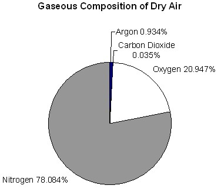

**Summary**

Why do we care about air? Breathe in, breathe out, breathe in... Most, if not all, humans do this automatically. Do we really know what is in the air we breathe? In this activity, students use M&M® candies to create pie graphs that show their understanding of the composition of air. They discuss why knowing this information is important to engineers and how engineers use this information to improve technology to better care for our planet.

**Engineering Connection**

Environmental engineers must understand air composition to figure out what is causing poor air quality and how to clean it up. Improving air quality is a challenge because so many chemicals are reacting in the air at any given moment. Environmental engineers analyze and model these processes and design ways to improve air quality for the benefit of the Earth's inhabitants.

**Educational Standards** 

-     Colorado: Math

-     Colorado: Science

-     Common Core State Standards for Mathematics: Math

-     International Technology and Engineering Educators Association: Technology

-     Next Generation Science Standards: Science

**Learning Objectives**

After this activity, students should be able to:

-   Describe the major gaseous components of the atmosphere.

-   Explain why engineers need to know the composition of air.

-   Use a circle graph (pie chart) to describe and interpret the atmospheric composition.

-   Explain relative sizes of fractions and percentages.

**Materials List**

Each student needs:

-   small bag of plain M&Ms® candies (or any other multi-color, equally-sized small candy or pieces)

-   8.5" x 11" blank sheet of paper

-   colored pencils or markers

-   (optional) small sandwich bags to organize the candies

Introduction/Motivation

**Background**

**Just imagine...** The layer of air around the Earth is only about 10 miles (15 km) thick. This is like the thickness of a human hair placed on a globe that is 45 cm in diameter. Only the bottom 3 miles (5-6 km) of this layer contains enough oxygen for living organisms.

Air is incredible! It is generally invisible (we cannot see or smell it), but we can feel it (wind). It can carry small particles (dust, fog, smoke) and large objects (airplanes, kites, birds, frisbees). It travels all over the planet but does not leave the atmosphere (some of the air you are breathing right now has already been in the lungs of your classmates). See Figure 1, Table 1 and the attached Layers of the Atmosphere Reference Sheet.

Figure 1. A graphic showing the layers of the atmosphere.

Table 1. A description of the layers of the atmosphere.

**The Composition of Air**

78% nitrogen (N2)

21% oxygen (O2), needed by most living things

0.9% argon (Ar)

0.1% is a mixture (neon \[Ne\], helium \[He\], methane \[CH4\], krypton \[Kr\], hydrogen \[H2\], nitrous oxide \[N2O\], xenon \[Xe\] and carbon dioxide \[CO2\]). Carbon dioxide is a colorless, tasteless and odorless gas, usually present at a concentration of 0.03% of the atmosphere.

Please see Figure 2 or the attached Air Composition Pie Graph Worksheet.

Figure 2. Gaseous composition of dry air.

**Why Engineers Care**

Engineers continually monitor the components of air. It is important for them to know the components of air under normal (or base) conditions so that when they monitor levels of N2, O2, Ar, N2O, CO2 and other gasses, they can tell when the air is no longer at base conditions and may be harmful to humans and the environment. For instance, power plant emissions are always monitored for major deviations beyond that of normal air. In fact, many devices are built into power plants to decrease the levels of carbon dioxide and particulate matter that are released into the atmosphere. Engineers monitor the emissions to make sure these devices are working properly. Increased levels of carbon dioxide and methane, and decreased levels of oxygen are considered dangerous. With these factors in mind, engineers are continually working to monitor and improve the air on our planet.

Procedure

**Before the Activity**

-   Gather materials (try not to eat the M&Ms!). Each student needs 7 brown, 2 red and 4 yellow M&Ms (if helps to use small sandwich bags to organize the candies).

-   If needed, make copies of the How Much? Pre/Post Quiz (two per student), Layers of the Atmosphere Reference Sheet(for an overhead projector sheet or handout), and Air Composition Pie Graph Worksheet (suitable for grades 3-4 students).

**With the Students**

1.  Ask students: What is air? What is in air? From what components is air made? Take suggestions. Tell them they will find out more in this activity.

2.  Give each student a bag of M&Ms. Tell them NOT to eat the M&Ms (yet)!

3.  Explain that air is made up of many different things, and that each different colored M&M represents a different "ingredient."

4.  Have students sort their M&Ms by color (7 brown, 2 red and 4 yellow M&Ms). (Note: These colors are suggested based on the usual distribution of M&Ms in a bag. If students do not have enough for 7 of one color, have them trade with another student or open up another bag of M&Ms.)

5.  As shown in Figure 3, arrange 7 brown, 2 red, and 1 yellow M&Ms in a circle on a blank sheet of paper, with like colors together and the sides of the M&Ms touching. The extra yellow M&Ms will be used later.

6.  Trace around the circle. Estimate the center of the circle and mark it with your pencil.

7.  Draw a line from the center of the circle to the points at which the colors change on the circle of M&Ms (see Figure 3, you should draw three lines).

Figure 3. M&M pie charts representing the composition of air.

1.  Label each section with the color and number of M&Ms (see Figure 3).

2.  Write the fraction that represents each "pie piece" (the number of each color of M&Ms divided by the total number of M&Ms).

3.  List the fractions from largest to smallest. (Answer: 7/10, 2/10, 1/10)

4.  Tell the students that the brown M&Ms represent nitrogen (N2) at 78%, the red ones represent oxygen (O2) at 21%, and the yellow ones represent argon (Ar) at 0.9%. Some other elements also exist in the air that are too small for the pie chart. They include neon (Ne), helium (He), methane (CH4), krypton (Kr), hydrogen (H2), nitrous oxide (N2O), xenon (Xe) and carbon dioxide (CO2). These gases make up the remaining 0.1%. See Figure 2 or the attached Air Composition Pie Chart Worksheet.

5.  Next, tell students they are going to make a new graph representing the air outside of a power plant. Ask them if they think this air is safe to breathe.

6.  Arrange 5 brown, 1 red and 4 yellow M&Ms in a circle on a blank sheet of paper, with like colors together and the sides of the M&Ms touching.

7.  Trace around the circle. Estimate the center of the circle and mark it with your pencil.

8.  Draw a line from the center of the circle to the points at which the colors change on the circle of M&Ms (you should draw three lines).

9.  Label each section with the color and number of M&Ms.

10. Write the fraction that represents each "pie piece" (the number of each color of M&Ms divided by the total number of M&Ms).

11. Have the students compare these "air readings" to the normal (or base) conditions and decide whether or not they think the air is polluted. (Answer: This air has been polluted; it has more yellow M&Ms \[carbon dioxide, methane, etc.\] and fewer red M&Ms \[oxygen\]. People need oxygen to breathe and because less oxygen is in the air around this power plant, more effort should be made to reduce the amount of pollutants the plant releases into the air.)

12. (optional) To make the activity more challenging, have two students combine their colors and repeat the activity, this time with 20 M&Ms, making a bigger circle. Now the fractions are 2/20, 4/20 and 14/20. Make the connections to equivalent fractions. Can two more groups combine? Can the entire class combine?

13. Eat and enjoy the M&Ms.

Attachments

-   How Much? Pre/Post Quiz (docx)

-   How Much? Pre/Post Quiz (pdf)

-   Layers of the Atmosphere Reference Sheet (docx)

-   Layers of the Atmosphere Reference Sheet (pdf)

-   Air Composition Pie Graph Worksheet (suitable for grades 3-4) (docx)

-   Air Composition Pie Graph Worksheet (suitable for grades 3-4) (pdf)

-   How Much? Pre/Post Quiz Answer Key (docx)

-   How Much? Pre/Post Quiz Answer Key (pdf)

Safety Issues

-   M&Ms, even the plain ones, contain peanut oil. Before doing this activity, check to see if any student has a peanut allergy. If so, you may want to use another multi-color, small candy such as Skittles®.

Troubleshooting Tips

-   Make sure all students are using the same colors for each of the air components. This facilitates understanding in classroom discussions and decreases confusion when referring to air components by color.

-   In the activity, some of the percentages are loosely rounded for purposes of simplification. Depending on your students, you may want them to be more precise in mapping their candy proportions and pie charts to the percentages of gas composition in air.

Assessment

**Pre-Activity Assessment**

*Pre-Quiz: *Administer the How Much? Pre/Post Quiz. Note that two blank quizzes are provided per sheet (cut them apart). Review students' answers to gauge their base knowledge about the proportions of various gases in air. If students are not very familiar with the gas components and their percentages, tell them they will find out more in this activity. Administer the same quiz at activity end.

**Activity Embedded Assessment**

*Brainstorming*: In small groups, have students engage in open discussion. Remind students that in this forum, no idea or suggestion is "silly." All ideas should be respectfully heard. Encourage wild ideas and discourage criticism of ideas. Have students think of something else for which they may be able to use a circle graph (pie chart). Possible ideas include: age/height/weight/gender/eye color of students in class or the number of students in each grade. Then, have students create new charts (with or without M&Ms).

**Post-Activity Assessment**

*Discussion Question*: Ask the students and discuss as a class:

-   Describe why the air composition pie chart information would be important to engineers working with air pollution. (Answer: Environmental engineers are often responsible for reducing air pollution created by the emissions from factories and power plants. Knowing the natural (unpolluted) composition of air gives them baseline information with which to compare factory emissions. Then, they can design ways to adjust the composition of emissions, which often have high levels of carbon dioxide and particulates, resemble that of unpolluted air.)

*Post-Quiz:* At activity end, administer the How Much? Pre/Post Quiz again. Compare students' answers to their pre-quiz answers to gauge their changes in content knowledge.

Activity Extensions

Give students a data table expressing the percentage composition of the atmosphere and have them create a graph with their M&Ms that represents the data. Challenge them to make more than one type of graph (bar, circle, etc.).

Research the atmospheric compositions of other planets. Create M&M circle graphs to represent the other atmospheres.

Demonstrate the composition of air with a jar of marbles. Use 10 marbles, 7 of one color (representing nitrogen), 2 a contrasting color (representing oxygen), and 1 a third color (representing argon).

Activity Scaling

**For younger students in grades 1-2:**

-   Consider providing students with blank pie chart circle outlines (see Figure 3) and have them place M&Ms in them to match.

-   Focus on the size of each fraction, for example, 7/10 M&Ms are more than 1/10.

-   Have students make a third circle with 4 brown, 4 red, 4 yellow and 4 green M&Ms to demonstrate the fractions 4/16 (1/4), 8/16 (1/2), 12/16 (3/4).

**For younger students in grades 3-4:**

-   Assign students to complete the Air Composition Pie Chart Worksheet

-   Convert their fractions into decimal notation.

-   List from largest to smallest the six fractions 7/10, 14/20, 2/10, 4/20, 1/10, 2/20.

-   Find the fraction of nitrogen + oxygen, nitrogen + argon, and oxygen + argon.

**For older students:**

-   Add up the actual values for nitrogen (N2) 78%, oxygen (O2) 21%, and argon (Ar) 0.9% to see that they only add up to 99.9%.

-   \[Extension Activity\] Explain why the fractions in the small circle (7/10, 2/10, 1/10) are equal to those in the big circle (14/20, 4/20, 2/20).

-   Add fractions in various combinations using 7/10, 2/10, 1/10, 14/20, 4/20, 2/20.

Note: This may be confusing to students since they will have 7/10 in the small circle, yet when they make a bigger circle they will have 14/20. Students may incorrectly assume that 7/10 + 7/10 = 14/20. If you try this activity, you may want to use different colors for the big circle so that the browns are associated with 1/10 (seven of them), while the blues (for example) are associated with 1/20 (14 of them).

References

EEK! What is ozone? Hole in the ozone layer? Environmental Education for Kids, Wisconsin Department of Natural Resources. Accessed July 19, 2004. http://dnr.wi.gov/org/caer/ce/eek/earth/air/ozonlayr.htm

Gaseous Composition of Dry Air, Table 3.1. ENS 23: The Physical and Chemical Environment, Spring 2005, University of California-Santa Cruz. Accessed September 13, 2006. http://eesc.columbia.edu/courses/ees/slides/climate/table\_1.html

Kalman, Bobbie and Janine Schaub. *The Air I Breathe*. New York, NY: Crabtree Publishing Company, 1993.
